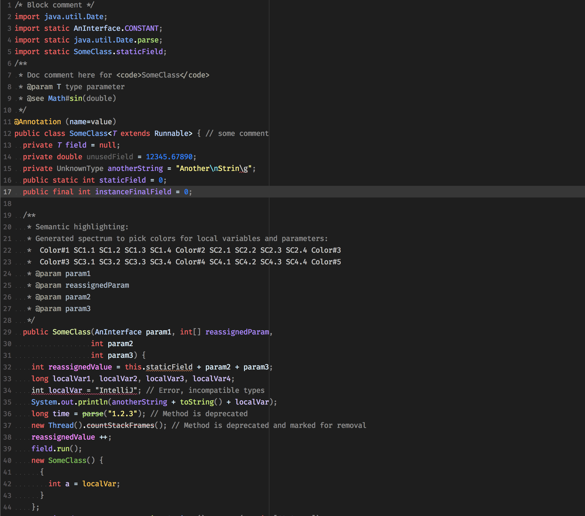
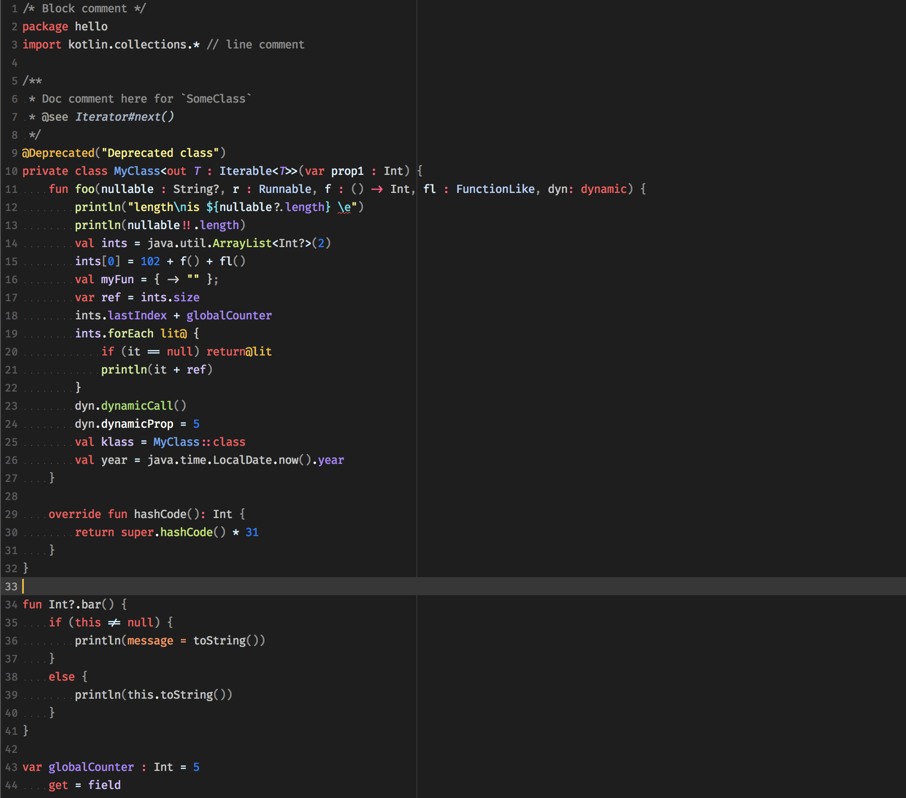
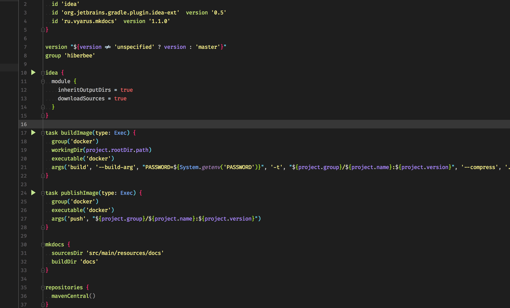
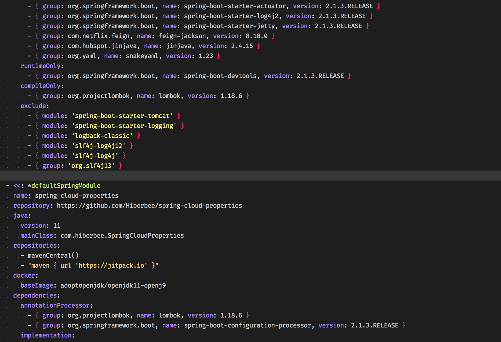

# Hiberbee IntelliJ theme

## Install

- Intellij Color scheme:

    
    Preferences > Editor > Color Scheme > Import scheme > Intellij icls file
    
- Material theme (starting from 3.8 plugin version):

    
    Preferences > Appearance & Behaviour > Material Custom theme > Load from file     

## Examples

### Java

### Typescript

### Kotlin

### Gradle

### Yaml

