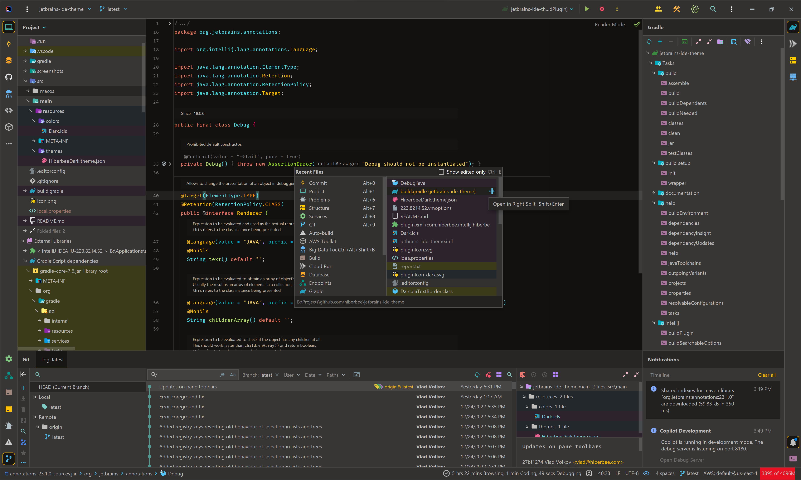
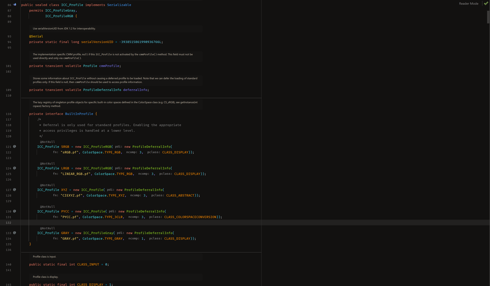

# Jetbrains IDE Theme

## IDE

### JetBrains Family

## Terminals

### Windows Terminal

See [official documentation](https://learn.microsoft.com/en-us/windows/terminal/custom-terminal-gallery/custom-schemes)
and checkout the content of [settings.json](src/windows-terminal/settings.json)
