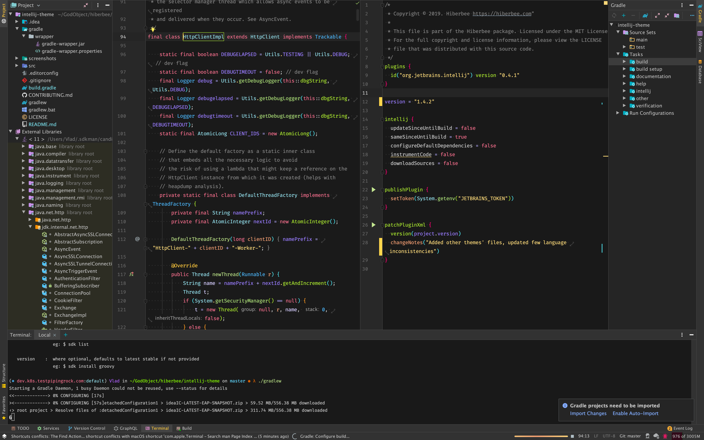
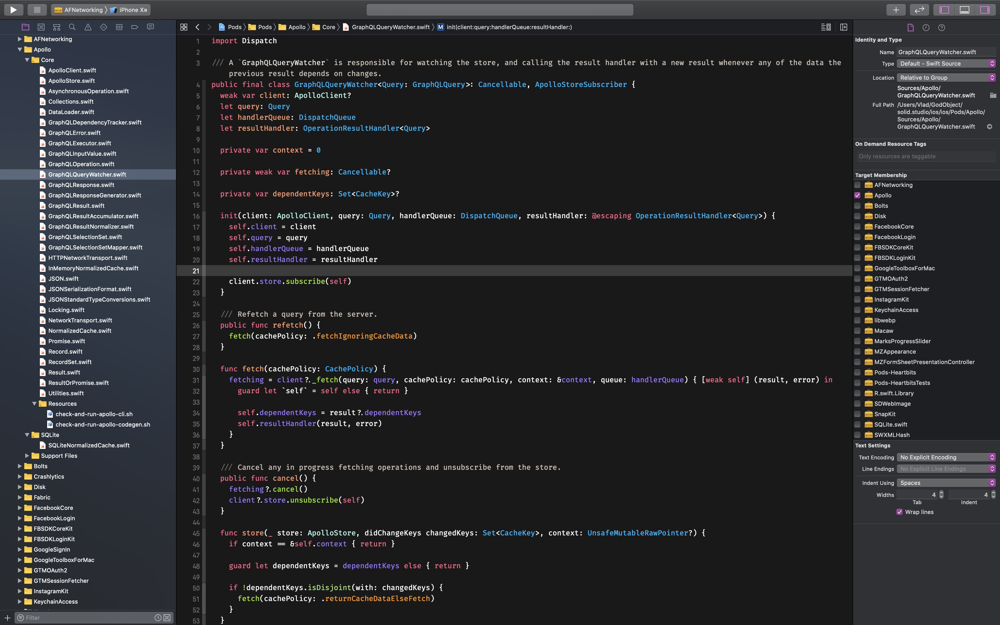

# Jetbrains IDE Theme

## IDE

### JetBrains Family

### XCode

Place file from `src/xcode/resources/Hiberbee.xccolortheme` in `$HOME/Library/Developer/Xcode/UserData/FontAndColorThemes` directory

### VSCode

*WIP*

## Terminals

### Windows Terminal

### iTerm

### MacOS Terminal

## Shells

### Fish
